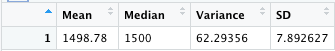
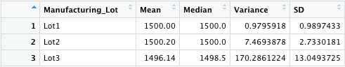
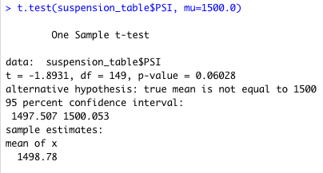
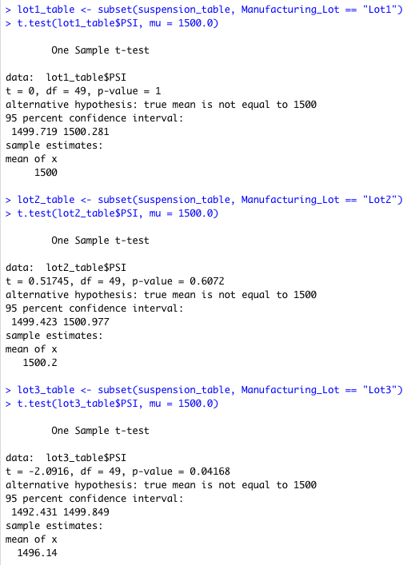

# MechaCar_Statistical_Analysis
R Script files for statistical analysis of car manufacturing data to identify
predictive variables of fuel efficiency, collect summary statistics on
suspension loads, and analyze the statistical differences among specific
manufacturing lots relative to the population.
 
## Linear Regression to Predict MPG
We first create a linear model for data found in
[`MechaCar_mpg.csv`](Resources/MechaCar_mpg.csv), considering the fuel
efficiency, `mpg`, as a linear combination of `vehicle_length`,
`vehicle_weight`, `spoiler_angle`, `ground_clearance`, and `AWD` (boolean
integer for "All Wheel Drive"). This results in the following model:


Considering a 5% significance level, we thus see from our model summary above
that the following parameters generate a non-random amount of variance to the
`mpg` data:

| Parameter          | p-value     |
| -----------        | ----------- |
| `vehicle_length`   | 2.60e-12    |
| `ground_clearance` | 5.21e-08    |

By contrast, the linear relationship to the other parameters in this data set
is likely due to chance. In addition, we see from the coefficients that the
slope of this model is non-zero. Instead, `mpg` tends to increase as
`vehicle_length` and `ground_clearance` increase:

| Parameter        | Linear Model Coefficient |
| -----------      | -----------              |
| vehicle_length   | 6.267e+00                |
| ground_clearance | 3.546e+00                |

Finally, we see from the multiple r-squared value of 0.71 that this linear
model will predict the mpg of MechaCar prototypes roughly 71% of the time.

## Summary Statistics on Suspension Coils
Next, we generate summary statistics for the pounds per square inch (PSI) of
the suspension coils for each vehicle contained in
[`Suspension_Coil.csv`](Resources/Suspension_Coil.csv). Considering the data
set as a whole, we find the following:



We then group the vehicles by their `Manufacturing_Lot` to obtain the summary
below:



Considering a maximum suspension coil weight variance of 100 PSI, we find that
while all manufacturing lots as a whole meet this requirement with variance of
62.29, the breakdown by individual lots shows that `Lot2` exceeds this
threshold with a variance of 170.29.

## T-Tests on Suspension Coils
Here we perform a T-Test to compare the mean suspension coil weight of this
data set to the population mean of 1,500 PSI. First considering the data set
as a whole, we find:



We thus obtain a p-value of 0.06, above the 5% significance level, indicating
the difference in mean suspension coil PSI between all lots in this data set
and the population mean is likely due to chance.

Then considering each lot individually, we obtain the following:



Summarizing the p-values:

| Manufacturing_Lot | p-value     |
| -----------       | ----------- |
| Lot1              | 1.00        |
| Lot2              | 0.61        |
| Lot3              | 0.04        |

Again assuming a 5% significance level, we can thus conclude that the
differences in mean from the population value for `Lot1` and `Lot2` are
likely due to chance, however the difference for `Lot3` is statistically
significant.

## Study Design: MechaCar vs Competition
Here we consider a statistical study to quantify the performance of MechaCar
vehicles relative to their competition. The following metrics are therefore of
particular interest:

- Fuel Efficiency
- Horsepower
- Safety Rating

Narrowing on the analysis of fuel efficiency, we can formulate the null and
alternative hypotheses as follows:

```
H_0 : The mean fuel efficiency between MechaCar vehicles and that of its
      competitor are equal, i.e:
      mean_mpg_MechaCar = mean_mpg_competitor

H_a : The mean fuel efficiency between MechaCar vehicles is less than that of
      its competitor, i.e:
      mean_mpg_MechaCar < mean_mpg_competitor
```

Since we would be comparing the difference in distribution means from two
samples, we would use the two-sample t-test, ensuring to use the one-sided
version since we hope to find the MechaCar fuel efficiency is significantly
less than that of its competitor.

This analysis would require an additional dataset comparable to
[`MechaCar_mpg.csv`](Resources/MechaCar_mpg.csv) but for a competing vehicle
manufacturer. If in addition it included similar parameters such as
`vehicle_length`, `vehicle_weight`, etc, it could be combined with this data
set to strength the correlation analysis of fuel efficiency as it relates to
other vehicle parameters.

## Usage
All code is contained in the single R file
[`MechaCarChallenge.R`](MechaCarChallenge.R). The user can therefore replicate
these results by first installing R at the
[Comprehensive R Archive Network (CRAN) server](https://cran.r-project.org/mirrors.html)
and scrolling down to the U.S links (any U.S mirror will work). After
installation, one should then navigate to the
[RStudio Download Page](https://www.rstudio.com/products/rstudio/download/?utm_source=downloadrstudio&utm_medium=Site&utm_campaign=home-hero-cta#download)
and select the appropriate version for installation. Upon completion, the user
can clone this repository, launch RStudio, and open the file
`MechCarChallenge.R` for use in the IDE. From here, the user should set the
working directory to the root of this repository by selecting the "Files" tab
of the multi-tool pane, navigating to the root of this repository, and
selecting "More > Set As Working Directory". The user can then run snippets of
the R file by highlighting desired commands and selecting "Run". Note that
snippets must run in order for successful completion.
