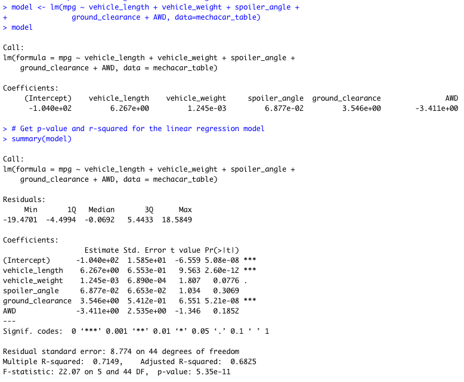

# MechaCar_Statistical_Analysis
R script files for statistical analysis of car manufacturing data to identify
predictive variables of fuel efficiency, collect summary statistics on
suspension loads, and analyze the statistical differences among specific
manufacturing lots relative to the entire population.

## Linear Regression to Predict MPG
We first create a linear model for data found in
[`MechaCar_mpg.csv`](Resources/MechaCar_mpg.csv), considering the fuel
efficiency, `mpg`, as a linear combination of `vehicle_length`,
`vehicle_weight`, `spoiler_angle`, `ground_clearance`, and `AWD` (boolean
integer for "All Wheel Drive"). This results in the following model:

Considering a 5% significance level, we thus see from our model summary above
that the following parameters generate a non-random amount of variance to the
mpg data:

| Parameter        | p-value     |
| -----------      | ----------- |
| vehicle_length   | 2.60e-12    |
| ground_clearance | 5.21e-08    |

while the linear relationship to the other parameters in this data set is
likely due to chance. In addition, we find see from the coeffients that
the slope of this model is non-zero, instead that `mpg` tends to
increase as `vehicle_length` and `ground_clearance` increase:

| Parameter        | Linear Model Coefficient |
| -----------      | -----------              |
| vehicle_length   | 6.267e+00    |
| ground_clearance | 3.546e+00    |

Finally, we see from the multiple r-squared value of 0.71 that this linear
model that this linear model will predict the mpg of MechaCar prototypes
roughly 71% of the time.